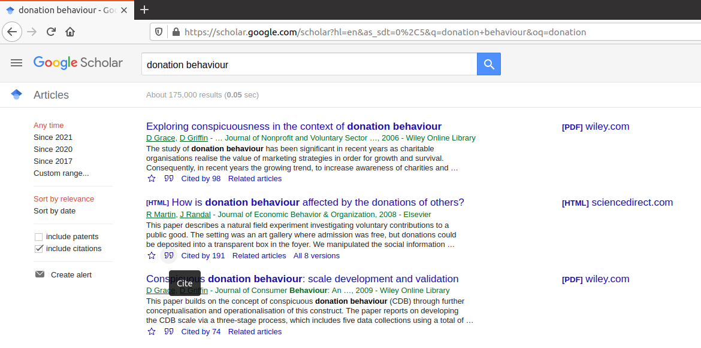
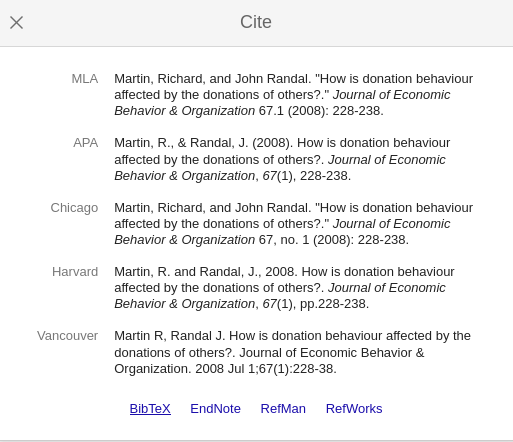
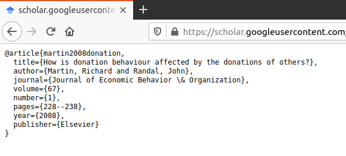

```{r setup, include=FALSE}
knitr::opts_chunk$set(echo = TRUE)
```

## Statement of academic integrity

Students must abide by  [UVic
  academic regulations](https://www.uvic.ca/calendar/undergrad/index.php#/policy/Sk_0xsM_V?bc=true&bcCurrent=08%20-%20Policy%20on%20Academic%20Integrity&bcGroup=Undergraduate%20Academic%20Regulations&bcItemType=policies)
 and observe standards of scholarly integrity
(i.e. no plagiarism or cheating). Therefore, this assignment must be
taken individually and not with a friend, classmate, or group. You are
also prohibited from sharing any information about the assignment with
others. I affirm that I will not give or receive any aid on this assignment 
and that all work will be my own. **put your name here**

## Referencing:

I like to use the .bib format for references:

### Journal articles:

Go to [Google scholar](https://scholar.google.com/)  and search.

To cite click on the quotation marks " 



Then choose BibTeX



Then copy and paste the following into your scholar.bib file.




Now I shamelessly plug one of my own papers, which is not at all relevant: [@martin2008donation]. 

### Online resources.

Google scholar is convenient for generating citations for journal articles, but does not include things like newspapers, websites, etc.  This [website](https://www.bibme.org/bibtex/website-citation) is much more broad than google scholar.  Make sure you select BibTeX generic citation, and then click through a few screens to get your citation.  Your citation should look similar to my citation above. By including a section called #References in my .Rmd file my list of references is auto generated in a consistent style. 

# References
